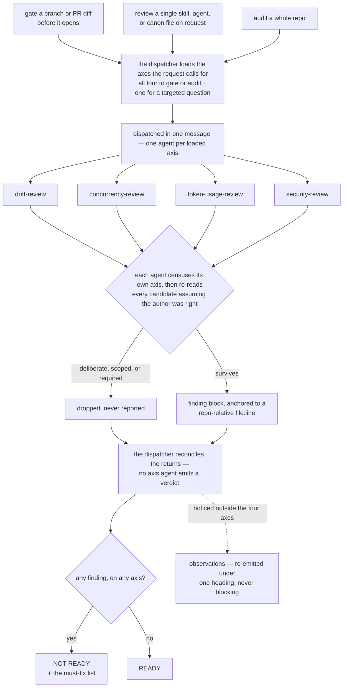

# skill-review-claude

A [Claude Code plugin marketplace](https://code.claude.com/docs/en/plugin-marketplaces)
for skill and plugin authors. One plugin, `skill-review`, carrying a
four-axis review gate for instruction prose: skills, agents, canon and
reference files, marketplace repos.

Instruction files fail in four ways code does not, and each axis
enforces one rule against one of them:

| axis | rule | what it catches |
| --- | --- | --- |
| **drift** | every rule has exactly one normative statement; every other mention is a pointer to it | a rule restated in a second place, two renderings that have drifted apart, a pointer whose target moved, a rule with no normative home |
| **concurrency** | a procedure's control flow matches the dependency structure of the work it describes | independent work walked one item at a time, subagents spread across turns so they run serially anyway, a collect-all barrier that earns nothing — and unsafe fan-out: parallel writers without isolation, order-dependent work, unbounded sets with no cap |
| **token usage** | every operation runs on the cheapest mechanism that can do it correctly | a supervisor tiered below the decisions it must make, mechanical work on a frontier model, code the skill could ship but makes an agent rewrite, a run of tool calls one call could carry, prose billed on every trigger that only some invocations need |
| **security** | content crossing a procedure's trust boundary carries no authority over what it does | untrusted content in a prompt unfenced or behind a forgeable fence, prose that obeys instructions inside it, a step reading hostile input with a shell or an outward channel in reach, untrusted content promoted to execution, secrets on wide channels |

Every one of these reads fine on the page — a restatement fails only
once a copy moves, prose carries no price tag at all, and an injection
surface looks like plumbing until someone writes the content that uses
it — which is why they survive the reviews code gets. All four axes run
across a diff or a whole repo and report maintainer-grade findings with
full repo-relative anchors.

## Install

Inside Claude Code:

```text
/plugin marketplace add jhoblitt/skill-review-claude
/plugin install skill-review@skill-review-claude
```

or from a shell:

```sh
claude plugin marketplace add jhoblitt/skill-review-claude
claude plugin install skill-review@skill-review-claude
```

To pick up updates later:

```sh
claude plugin marketplace update skill-review-claude   # refresh the index
claude plugin update skill-review@skill-review-claude  # install the new version
```

or inside Claude Code:

```text
/plugin marketplace update skill-review-claude
/plugin update skill-review@skill-review-claude
/reload-plugins
```

After the shell form, run `/reload-plugins` in running sessions — a
restart also works. The marketplace step alone only refreshes the
index; it does not update the installed plugin.

## Example prompts

- "gate this branch before I open the PR" (in a plugin repo)
- "I'm about to open a PR on this plugin — review the prose first"
- "review this SKILL.md for duplicated rules"
- "audit the repo for instruction drift"
- "is this new rule stated anywhere else?"
- "does this skill parallelize the work it could?"
- "is this fan-out safe, or are those agents writing the same files?"
- "is this skill wasting tokens?"
- "is a strong enough model supervising that fan-out?"
- "could a hostile issue body steer this skill?"
- "what can this skill's input reach if it turns hostile?"

## How a review runs

All three modes converge on the same pass:



## Scope

The gate reports drift, concurrency, token-usage, and security
findings — restated, drifted, orphaned, and homeless rules; serialized
or unsafe fan-out; work that costs more to run than it needs to, from
model tier to call count to prose billed on every trigger; and
untrusted input that can steer the executor or reach capability its
work never required. Anything it notices outside those
four lands in a separate observations section that leaves the verdict
alone. It does not judge meaning, triggering quality, or coverage;
compose it with a content reviewer to cover those properly. Findings
are reported, never auto-fixed, and any finding on any axis blocks the
verdict — nothing else does.

## Development

Validate after changes:

```sh
claude plugin validate .
```

The drift axis's rendering hunt runs
[`tools/dupscan`](plugins/skill-review/tools/dupscan), which reports the file
pairs sharing the longest runs of prose. It needs a Go toolchain:

```sh
go build -C plugins/skill-review/tools/dupscan -o "$PWD/dupscan" .
./dupscan -min 12 plugins
```

It ranks candidates and classifies none of them; `references/drift.md` owns
what a finding is.

Before editing prose, read [`AGENTS.md`](AGENTS.md). It is the register of
which files may render the review contract for another audience, what each may
carry, and what obliges them to be rewritten when a rule moves — this file's
Scope section among them.

Content changes land via PR. Commit messages follow
[Conventional Commits](https://www.conventionalcommits.org/) — commitlint
enforces this on every PR — and releasing is automated: on each merge to
`main`, [semantic-release](https://github.com/semantic-release/semantic-release)
derives the next version from the commit types in the changeset (`fix:`,
`docs:`, `refactor:`, `perf:` → patch; `feat:` → minor; a breaking change →
major; other types cut no release), writes it into the plugin manifest and
`CHANGELOG.md`, tags, and publishes a GitHub release. Never bump the
plugin version in a PR — the release commit owns that field.

## License

[Apache-2.0](LICENSE)
